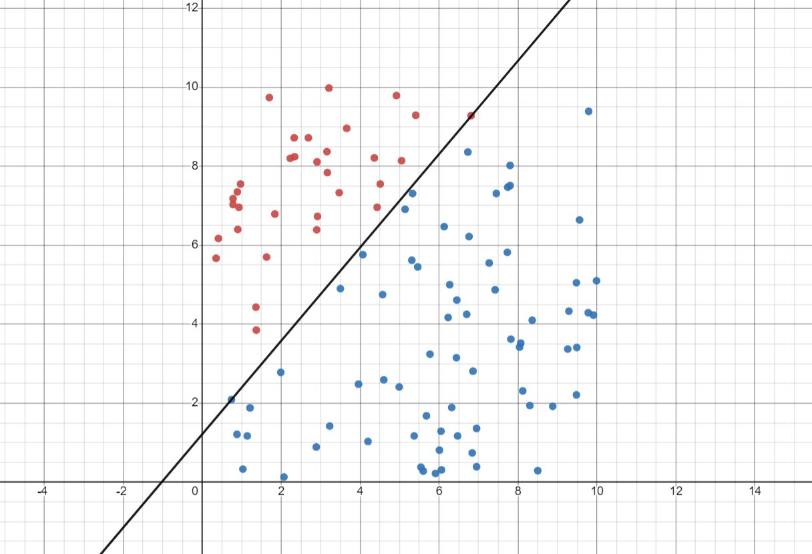

# Introduction
I'm implementing some Machine Learning Algorithms in form of little tools in this repository, some have graphics as well.
Graphical tools are mostly implemented using `Javascript`, `CSS`, `HTML`.
Non-Graphical tools are mostly implemented in `C++` and `Python`.

# Linear Regression
We are trying to fit a linear function (called hypothesis in Machine Learning) which describes our datas the best. This function is defined as:
$$h(X) = \sum^{i=n}_{i=0}\theta_i X_i = \Theta^T X$$
keeping in mind that:
$$X_0 = 1$$
So our task is to find thetas.
## Linear Regression Visualizer
A tool you can see the Gradient Descent Algorithm with your own eyes.

## General Linear Regression
A C++ program which will find the closest linear function which has the condition : $$f : R^n \rightarrow R \\ \\ \\ \\ \\ ( n \in \mathbb{Z}^+ )$$ for any any and any number of datas. It uses Gradient descent algorithm.

# Classification Problems
## Logistic Regression
This time we are trying to solve a classification problem. A very nice example for this which was mentioned in CS229 Stanford class by Andrew NG is the breast cancer tumor problem. There are several features for a tumor and you have a set of datas with binary out put (the tumor is either malignant or it is not).
Based on this datas we will be able to predict the chance that a tumor is malignant.
This time we are trying to fit a sigmoid funtion that describes the datas the best. (In Mathematical terms: has the maximum likelihood)
$$h(X) = \frac{1}{1-e^{-\Theta^T X}}$$
What this function is doing is actually drawing a linear function between datas with value 1 and 0 and can use it to predict new input datas.

As an example I gave the code a 2D example of tumor malignancy prediction:
Lets assume the X axis demonstrates of tumor and the Y axis is showing tumor's weight.
Red Dots show malignant tumors and blue ones are showing non-malignant tumors.

Let's give the datas to the code.

As we can see it successfully finds the parameters and the prediction values for given data are pretty satisfying.
The line which the algorithm drew between the malignant and non-malignant datas is shown below:

Two popular numberical methods for maximizing the likelihood are:
### Gradient ascsent
The logic is excatly like gradient descent, but this time we are trying to reach the maximum. Overally, it is a simple algorithm, but very slow.

### Newton's method
This method converges really fast, albeit each iteration is too expensive because it includes calculating the hessian matrix and inverting it along with multiplying matrices.

## Perceptron Learning Algorithm
In 1960s this algorithm was believed to be the way our brains actually work. It is simple but there is no probabilistic interpretations behind it, so not the best algorithm.
Image below shows the 100 datas, which could be exactly divided by some straight line, I gave to [perceptron_learning_algorithm.py](https://github.com/Danial-Hosseintabar/ML-Algorithms/blob/main/Perceptron%20Learning/perceptron_learning_algorithm.py) and the seperating line it found.

